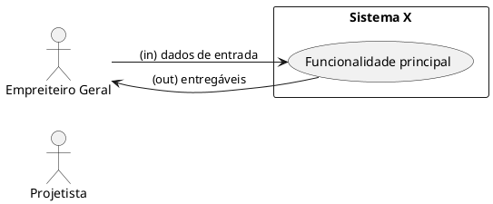
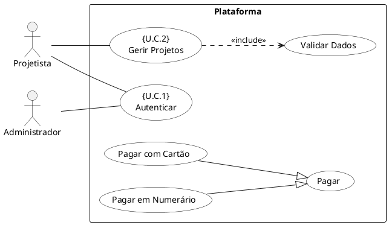
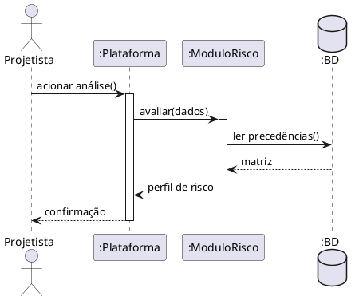
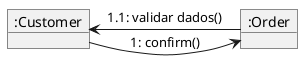
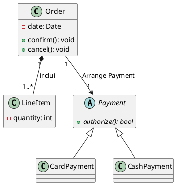
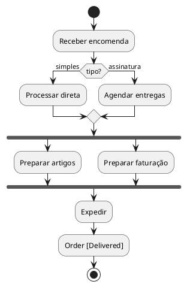
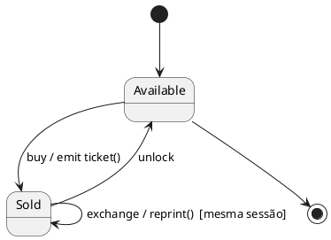
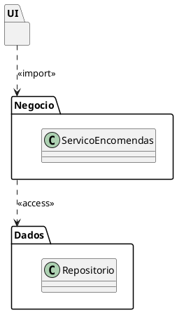
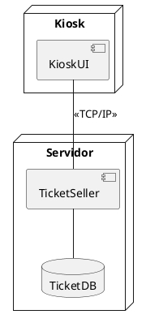

# Exemplos PlantUML por Tipo de Diagrama

Exemplos renderizáveis que modernizam a notação UML 1.x dos materiais RMAC (diagramas de "colaboração" → comunicação UML 2.x). Renderizar com:

```bash
java -jar plantuml.jar -charset UTF-8 -o ../media diagrama.puml
```

## 1. Diagrama de Contexto (casca da cebola — caixa preta)



Nota: sem fluxos de mensagens detalhados — são prematuros antes dos casos de uso (P1). Atores = papéis.

## 2. Diagrama de Casos de Uso (nível zero, com include/extend/generalização)



Nota: `«include»` para obrigatório; generalização (triângulo) para variantes de um caso abstrato. `«extend»` seria `Extension ..> Base : <<extend>>`.

## 3. Diagrama de Sequência (comportamento complexo)



Nota: ativações cheias = a computar; retornos tracejados. Nível 2 (interno funcional, sem conceção estrutural).

## 4. Diagrama de Comunicação (ex-colaboração; interações simples)



Nota: numeração aninhada `1.1` marca a sequência; usar só quando a lógica é simples.

## 5. Diagrama de Classes (associação, composição, herança)



Nota: composição = diamante cheio (`*--`); agregação seria diamante oco (`o--`). Abstrata em itálico (PlantUML: `abstract`). Visibilidade `+`/`#`/`-`.

## 6. Diagrama de Atividades (branch + fork/join + fluxo de objetos)



Nota: guards entre `[...]` mutuamente exclusivos e completos; fork/join em par; objeto com estado entre `[...]`.

## 7. Diagrama de Estados (entry/exit, transição interna)



Nota: `evento [guard] / ação`; transição interna (`Sold --> Sold`) não re-executa entry/exit; estados = situações (adjectivos), eventos = verbos.

## 8. Diagrama de Pacotes («access» vs «import»)



Nota: `«import»` adiciona públicos ao namespace; `«access»` apenas permite ver.

## 9. Diagrama de Componentes e Deployment



Nota: nível de descrição (tipos) e nível de instância (`nome:Tipo`) não se misturam no mesmo diagrama.

## 10. Checklist de revisão antes de dar o diagrama por bom

- [ ] Nomes vêm do domínio do problema (nada de "Manager"/"Handler")?
- [ ] Atores são papéis (não pessoas/cargos)?
- [ ] Fronteira do sistema presente e com nome?
- [ ] Nível único de abstração no diagrama (sem misturar análise com conceção)?
- [ ] include vs extend corretos (obrigatório vs opcional)?
- [ ] Multiplicidades e guards completos?
- [ ] Restrições não representáveis em constricções/OCL, não em prosa?
